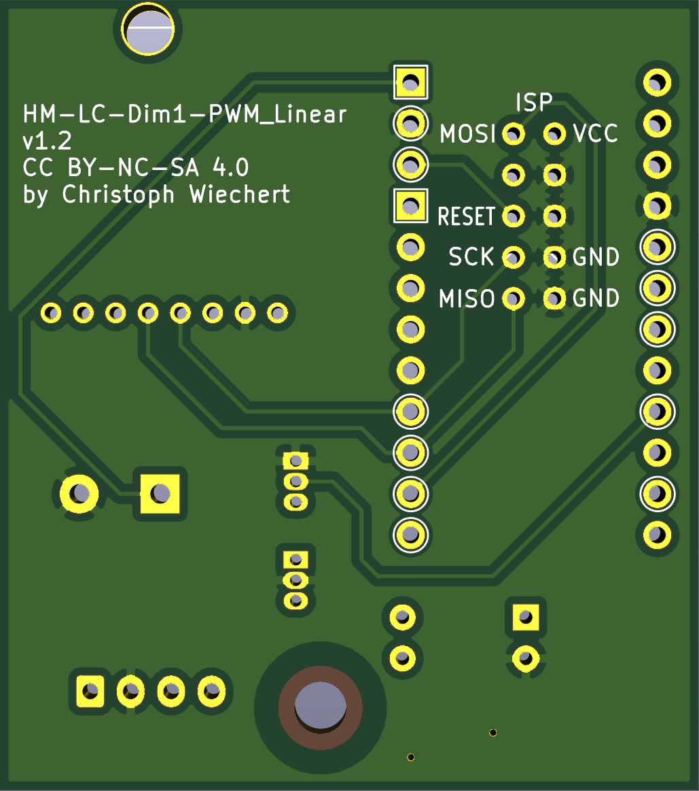

# HM-LC-Dim1PWM-LinearPWM

**HomeMatic Aktor mit linearer PWM Ausgabe über Optokoppler zum Beschalten von PWM-Dim Eingängen.**

Es gibt eine ganze Reihe [Meanwell-Netzteile](https://www.meanwell-web.com/en-gb/led-drivers/all-technology/all-power-format/all-output-voltage-v/all-output-current-a/all-output-power-w/all-input-voltage-v/all-ip-rating/pwm/) mit PWM Eingang zum Dimmen welche über diese Schaltung angesteuert und in Homematic eingebunden werden können.


Es ist darauf zu achten, dass man ein Netzteil mit **3 in 1 dimming** und **dimm-to-off** verwendet:
* 3 in 1: Dimmung über PWM, 0-10V und Potentiometer.
* dimm-to-off: Das Netzteil kann über den DIM-Eingang auch komplett ausgeschaltet werden.

Getestet wurde die Schaltung mit einem Meanwell LCM-40 Netzteil und 30W Konstantstrom-LED-Panel.
Das LCM-40 bietet zusätzlich einen 12V _FAN_ Anschluss worüber den die Schaltung mit Strom versorgt werden kann.

## Hardware

* Arduino Pro Mini 3.3V
* CC1101 Funkmodul
* C1: Elko 2200µF (optional)
* SMD Bauteile Größe 0805
  * C2: Kerko 100nF
  * C3: Kerko 100nF (für L78L05)
  * R1: 1,5kΩ
  * R2, R3: 280Ω
  * R4: 10kΩ
* D1: SMD LED Größe 1206
* SW1: SMD Taster 3x6x2,5mm
* U1: L78L05 Festspannungsregler Größe TO92 (optional)
* U2: Optokoppler PC817
* U3: DS18B20 Temperatursensor (optional)




## Sketch

Ein [Beispiel-Sketch](./HM-LC-Dim1PWM-LinearPWM.ino) ist im Repo hinterlegt.

Interssant ist die Instanziierung der PWM-Class:

```cpp
DimmerControl<HalType,DimmerType,PWM8<200,true,PWM_INVERSE> > control(sdev);
```

Wobei die Parameter des `PWM8`-Templates:
* `steps`: Anzahl Dimmer-Schritte
* `linear`: Flag um eine lineare Dimmerkurve zu erzeugen
* `inverse`: Dimmerkurve invertieren (nötig da Optokoppler)

**Es empfiehlt sich die Brown-Out-Detection des AVR zu deaktivieren um robuster gegen Spannungseinbrüche zu sein.**

## Changelog

### Version 1.2
* PullUp Widerstand R4 eingefügt 

### Version 1.1
* Markierungen ergänzt


## Lizenz

CreativeCommons BY-NC-SA 4.0

